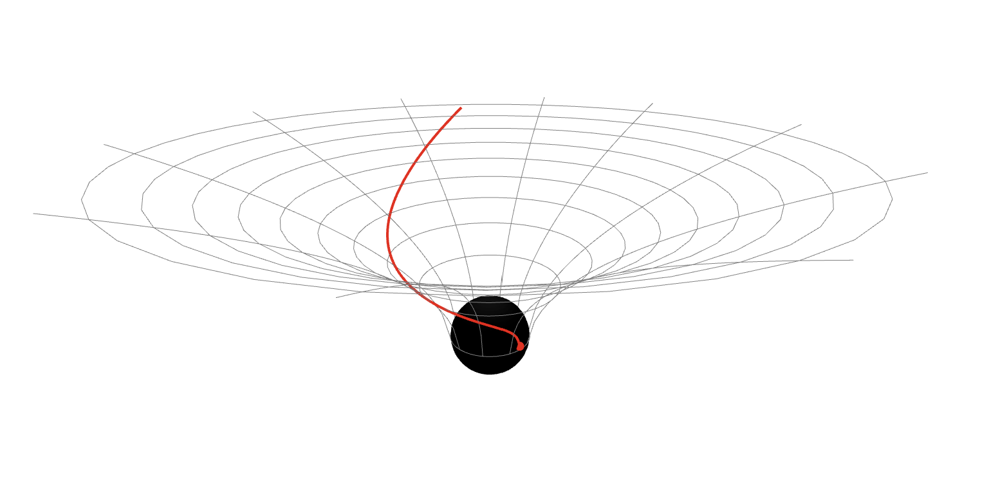

# Geodesics & Black-Hole Ray Tracing

A Python toolkit for computing geodesics in general-relativistic spacetimes and rendering black-hole images by ray tracing, with an exploratory machine learning speed up (work in progress).



## What it does

- **Metrics as sympy matrices**: n-sphere, Schwarzschild in any dimension, Reissner-Nordstrom, Kerr (Boyer-Lindquist), Majumdar-Papapetrou multi black-hole.
- **Symbolic tools**: Christoffel symbols and geodesic equations rendered as LaTeX in the notebook.
- **Numerical geodesics**: the acceleration is built symbolically once per metric, lambdified with common-subexpression elimination and cached, then integrated with DOP853. Horizon crossing stops the integration; equatorial crossings are recorded as events.
- **Animated 3D trajectories** with plotly, including Flamm-paraboloid / Kerr equatorial embeddings, ergosphere, and frame-dragging markers.
- **Thin disk ray tracing**: numerical Novikov-Thorne temperature profile (works for any stationary axisymmetric metric), Doppler boosting, tone mapping.
- **Neural surrogate**: an MLP learns `(b_y, b_z, theta_obs) -> (r_hit, phi_hit)` from a multiprocess-generated dataset, so a full image is one batched forward pass.

## Install

```bash
git clone https://github.com/<you>/geodesics
cd geodesics
pip install -e .          # core
pip install -e .[nn]      # + torch for the neural surrogate
```

## Quick start

```python
import numpy as np
from geodesics import Schwarzschild, solve_geodesic, animate_geodesic

bh = Schwarzschild(M_val=1.0, embedding=True)
x0, v0 = bh.from_cartesian(x=10, y=4, z=0, vx=-0.5, vy=0.1, vz=0, massive=True)
sol = solve_geodesic(bh, x0, v0, (0, 80))
animate_geodesic(sol, bh, coordinate_time=True).show()
```

Render a disk:

```python
from geodesics import temperature_interpolator, render_image, show_image
T = temperature_interpolator(bh, r_max=30)
img, r_hit, phi_hit = render_image(bh, T, theta_obs_deg=17, N=200, b_max=30)
show_image(img, b_max=30, mode='log')
```

## Notebooks

| | |
|---|---|
| `01_metrics_and_christoffel` | line elements, Christoffel symbols, geodesic equations |
| `02_geodesics_sphere_schwarzschild` | great circles, Schwarzschild infall, proper vs coordinate time |
| `03_kerr_and_majumdar_papapetrou` | Kerr orbits with frame dragging, equatorial embedding, two-black-hole spacetime |
| `04_accretion_disk_raytracing` | equatorial-crossing events, Novikov-Thorne profile, Schwarzschild and Kerr disk images |
| `05_neural_surrogate` | dataset inspection, MLP training, one-pass rendering, lensed-ring check |

Generate the dataset for notebook 5 with

```bash
python scripts/generate_dataset.py --n-angles 20 --n-per-angle 100 --k-max 3
```

## Layout

```
geodesics/
  metrics.py     Metric base class and concrete spacetimes
  symbolic.py    Christoffel symbols, LaTeX printing
  integrate.py   lambdified RHS, solve_geodesic, events
  disk.py        Novikov-Thorne flux, Doppler / redshift factors
  raytrace.py    per-ray tracing, brute-force renderer, tone mapping
  plotting.py    plotly animations, matplotlib helpers
  dataset.py     parallel dataset generation
  surrogate.py   torch model, training, NN renderer
```

Units: G = c = 1, lengths in units of M.

## Development

Notebook outputs are stripped on commit via [nbstripout](https://github.com/kynan/nbstripout):

```bash
pip install -e .[dev]
pre-commit install
```
